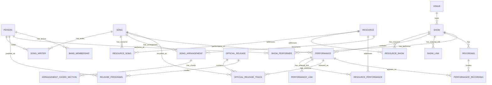

# Deadbot domain model

Deadbot's data is graph-shaped relational data: rows are stored in PostgreSQL tables, while foreign keys express the useful connections among songs, people, shows, venues, performances, and recording sources. This keeps the model straightforward to inspect and query without introducing a separate graph database.

## Core distinction

- A **song** is a composition, independent of a particular date or version.
- A **performance** is that song played at one particular show, with a place in the set.
- A **recording** is one captured source of a show, such as an audience tape, soundboard, matrix, broadcast, or official release source.
- A **performance recording** is the track and time location where a performance occurs within one recording source.

This distinction is foundational. One song can have many performances. One show can contain many performances and have many recordings. One performance can appear in many recording sources.

## Entities and relationships

| Table | Meaning |
| --- | --- |
| `people` | Any person relevant to the domain: musician, songwriter, producer, taper, engineer, or another contributor. |
| `songs` | Canonical compositions, identified by stable text IDs. |
| `venues` | Canonical places where shows occur. |
| `shows` | Dated events at a venue. |
| `performances` | Ordered song appearances in a show, including set and segue information. |
| `recordings` | A particular source of one show, with identifiers, lineage, and URLs. |
| `performance_recordings` | A performance's track/timing location in a recording. |
| `song_writers` | Many-to-many authorship relationship between people and songs. |
| `show_performers` | People who actually performed at a particular show, including guests and changing lineups. One row represents one role-and-instrument assignment. |
| `band_memberships` | One row per person's role and tenure in a named act (`grateful-dead` for this pass) -- who was a core or officially recognized member, in what role, and over what dates. A non-contiguous tenure (Mickey Hart's 1971 departure and 1975 return) carries one row per contiguous span. |
| `resources` | Source documents and external links, including interviews, reviews, tabs, lessons, videos, and future transcription pointers. |
| `resource_songs` / `resource_shows` / `resource_performances` | Typed relationships that attach a resource to the song, show, or performance it addresses. |
| `song_arrangements` | A source-specific interpretation or performance-specific arrangement of a song, with key, capo, tuning, and scope. |
| `arrangement_chord_sections` | Ordered chord progressions by section within one documented arrangement. |
| `show_links` | External links for a whole show, such as a full-show video or an official release page. |
| `performance_links` | External links for a particular song performance, with optional verified timestamp information. |
| `official_releases` | Commercial/official release metadata and its external album link. |
| `official_release_tracks` | Release tracks, mapped to a canonical performance for live releases and to a canonical song for studio releases. |
| `release_personnel` | People credited on a release, one row per role-and-instrument assignment. |

`performances` is deliberately ordered within a set. This makes normal song boundaries and continuous segues queryable from the canonical setlist without needing a separate transitions table at this stage.

## Song documentation and chords

Song documentation is also intentionally separated from the composition. A chord chart is often an interpretation, a transposition, or a chart for a particular performance—not a universal fact about a song. `resources` preserves the reference, the resource relationship tables identify its subject, `song_arrangements` identifies the chart's scope and key, and `arrangement_chord_sections` stores its ordered section-level progression. This model can later accommodate alternate keys, performance-specific arrangements, lessons, and transcriptions without overwriting one another.

## External links and official releases

Audio and video remain externally hosted. `show_links` and `performance_links` provide resolvable links without copying media into the repository. An official release is more than a link. The catalog holds both live releases
and studio albums, distinguished by `release_type`.
`official_release_tracks` makes a release's contents queryable: a live track
identifies the canonical performance it captures, and a studio track
identifies the composition it records. A track can remain unmapped when it is
an introduction, tuning, banter, or another non-song segment.

## Show performers

`show_performers` supports one or more assignments for a person at a show. Use a separate row for each role-and-instrument combination; for example, a performer who plays guitar and sings has two rows with the same `show_id` and `person_id`. `role` can describe their participation (such as `band-member` or `guest`), while `instrument` records the musical role (such as `guitar`, `vocals`, `piano`, or `tenor sax`). No controlled vocabulary is enforced yet.

## Band memberships

`show_performers` answers "who played this particular show"; `band_memberships` answers "who was in the band, in what role, over what dates" without scanning every show. Each row is one person's role and tenure in a named `act` (`grateful-dead` for this pass), bounded by `start_date`/`end_date` at whatever `start_precision`/`end_precision` the source supports (`day`, `month`, or `year`). This pass covers only core and officially recognized members; guest and sit-in appearances stay in `show_performers` and are never promoted here. A person with a non-contiguous tenure -- Mickey Hart left in February 1971 and returned in March 1975 -- carries one row per contiguous span, not one row with a gap.

## Integrity and loading

All canonical IDs are text, not database-generated integers. Foreign keys preserve the named relationships. The database also rejects a `performance_recordings` row when its performance and recording belong to different shows.

Load parent entities before their relationships: people, songs, venues, shows, song writers, show performers, performances, recordings, then performance recordings. See [README.md](README.md) for the complete import order.
